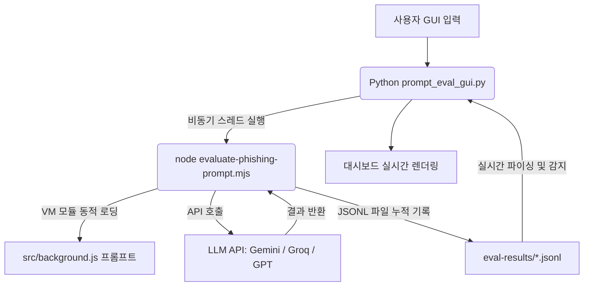

# 🛡️ PhishGuard 프롬프트 평가 및 테스트 도구 사용법 (Tutorial)

이 도구는 PhishGuard 크롬 확장프로그램(`src/background.js`)에 탑재된 인공지능 프롬프트의 스피어피싱(Spear Phishing) 탐지 성능을 검증하기 위해 개발된 **다크 테마 데스크톱 분석 대시보드**입니다.

Python의 현대식 GUI 라이브러리인 **CustomTkinter**를 활용하여 고해상도 반응형 디자인을 제공하며, 단독 실행 파일(`.exe`) 또는 스크립트 형태로 자유롭게 실행할 수 있습니다.

---

## 🏗️ 시스템 아키텍처 (하이브리드 구조)

이 도구는 **Python 프런트엔드 GUI**와 **Node.js 백그라운드 엔진**이 결합된 하이브리드 방식으로 작동합니다:



> [!TIP]
> **왜 이렇게 설계되었나요?**
> 크롬 확장프로그램의 프롬프트 소스코드(`src/background.js`)가 변경될 때마다 개발자가 GUI 코드를 매번 고칠 필요가 없습니다. Node.js 백그라운드 스레드가 해당 자바스크립트 모듈을 동적으로 가져와 직접 검사하므로, 확장프로그램 프롬프트 변경사항이 테스트 툴에 **실시간으로 100% 동기화**됩니다.

---

## 🚀 프로그램 실행 방법

### 방법 1: 원클릭 런처 실행 (가장 추천)
`tools/` 폴더 내부에 있는 **`run-prompt-eval-gui.cmd`** 배치 파일을 더블 클릭하여 실행합니다. 
이 런처는 컴퓨터 환경에 따라 다음과 같이 스마트하게 연동됩니다:
1. `dist/prompt_eval_gui.exe` (컴파일 완료된 단독 실행판)가 존재하면 **즉시 실행**하고 콘솔 창을 바로 닫습니다.
2. 실행 파일이 없는 경우, 로컬에 설치된 **Python**을 통해 `tools/prompt_eval_gui.py` 스크립트를 기동합니다.

### 방법 2: Python 스크립트로 직접 실행
터미널을 열고 프로젝트 루트 디렉터리에서 아래 명령어를 실행합니다:
```bash
python tools/prompt_eval_gui.py
```
*(실행 전 `pip install customtkinter darkdetect packaging` 설치가 필요합니다.)*

### 방법 3: 단독 실행 파일 빌드 및 구동
파이썬 의존성 패키지가 없는 PC에서도 실행할 수 있도록 단독 파일로 재컴파일하려면 아래 명령어를 입력하세요:
```bash
# PyInstaller 패키징 실행 (dist/prompt_eval_gui.exe 파일이 빌드됨)
C:\Users\DICT\AppData\Roaming\Python\Python314\Scripts\pyinstaller.exe --noconsole --onefile --collect-all customtkinter tools/prompt_eval_gui.py
```

---

## 💡 주요 기능 사용법 (Tutorial)

### 1️⃣ 데이터셋 일괄 평가 탭 (Tab 1)
대량의 표준 이메일 데이터를 AI 모델로 스캔하여 프롬프트의 위협 탐지 통계(정확도 등)를 한눈에 검증하는 기능입니다.

1. **설정 조절**: 좌측 패널에서 인공지능 모델(Gemini/Groq/GPT-4o), 불러올 데이터셋 종류를 선택합니다.
2. **슬라이더 조절**: 평가할 샘플 수(Limit), 읽을 시작 위치(Offset), API 호출 간 대기 시간(Delay)을 설정합니다.
3. **평가 실행**: **`평가 실행`** 버튼을 누르면 실시간으로 백그라운드 엔진이 동작합니다.
4. **대시보드 실시간 확인**:
   * 상단 상태판에 현재까지의 **정확도(Accuracy)** 및 위험도 등급(LOW/MEDIUM/HIGH)의 분포 수가 갱신됩니다.
   * 중앙 리스트 영역에 분석 완료된 이메일이 **가로형 카드 리스트**로 한 줄씩 추가됩니다. 카드 내부의 **`성공` / `실패`** 뱃지를 통해 AI가 정답 라벨과 동일하게 맞췄는지 즉시 식별할 수 있습니다.
5. **상세 분석 사유 보기**: 결과 리스트 중 하나를 클릭하면, 아래 상세 정보 창에 AI가 판단한 상세 보안 진단 요약문과 검출된 위협 키워드 지표가 깔끔하게 정돈되어 출력됩니다.
6. **중단 기능**: 연산이 너무 오래 걸리거나 설정이 잘못된 경우 **`중단`** 버튼을 눌러 안전하게 멈출 수 있습니다.

---

### 2️⃣ 개별 메일 수동 테스트 탭 (Tab 2)
임의의 스피어피싱 혹은 정상 이메일을 직접 작성하여 AI 모델이 어떻게 정보를 분류하고 요약하는지 집중적으로 단일 테스트하는 기능입니다.

1. **이메일 작성**: 좌측 입력 폼에 발신자 이름, 이메일 주소, 제목, 일시 및 이메일 본문(링크 주소나 의심 텍스트 포함)을 입력합니다.
2. **분석 실행**: **`분석 실행`** 버튼을 클릭합니다.
3. **결과 확인**:
   * **위험 등급 뱃지**: 분석이 완료되면 위험도에 따라 `위험도: HIGH` (빨간색 칩), `위험도: MEDIUM` (황토색 칩), `위험도: LOW` (초록색 칩) 배지가 업데이트됩니다.
   * **신뢰도 게이지**: AI 모델의 확신도를 나타내는 신뢰도 수치가 인디고 그라데이션 게이지바로 시각화됩니다.
   * **6대 의심 항목 체크리스트**: 메일 본문과 제목에서 피싱 공격 징후를 판독하여 위협 탐지 항목을 개별 카드로 보여주며, 의심(WARN) 항목은 빨간 칩으로 사유와 함께 상단에 정렬됩니다.
   * **판단 요약 & 지표**: AI가 왜 이 메일을 피싱으로 의심했는지에 대한 자세한 사유 및 식별한 지표(예: 발신자 변조, 비정상 링크 등) 목록을 출력합니다.
4. **디버깅 탭셋 활용**: 우측 하단 디버그 탭에서 아래의 고급 정보들을 확인할 수 있습니다.
   * **시스템 프롬프트 / 사용자 프롬프트**: 크롬 확장프로그램 코드를 통해 포맷팅되어 실제 AI 서비스로 전달된 최종 프롬프트 전문을 확인하고 복사할 수 있습니다.
   * **AI 원문 응답**: 정규화되기 이전의 AI 원본 JSON 문자열을 조회할 수 있습니다.
   * **실행 로그**: 통신 과정 중 발생한 네트워크 상태 및 로깅 기록을 실시간 추적합니다.

---

## 🛠️ 문제 해결 (Troubleshooting)

### API Key가 없다고 나오는 경우
- 프로젝트 루트 디렉터리의 `.env` 파일에 각 AI 모델에 맞는 API Key가 들어가 있는지 확인하세요.
- 지원되는 환경변수명:
  * Gemini: `GEMINI_API_KEY`, `GOOGLE_API_KEY`, `gemini_key`
  * Groq: `GROQ_API_KEY`, `groq_key`
  * GPT: `OPENAI_API_KEY`, `openai_key`
